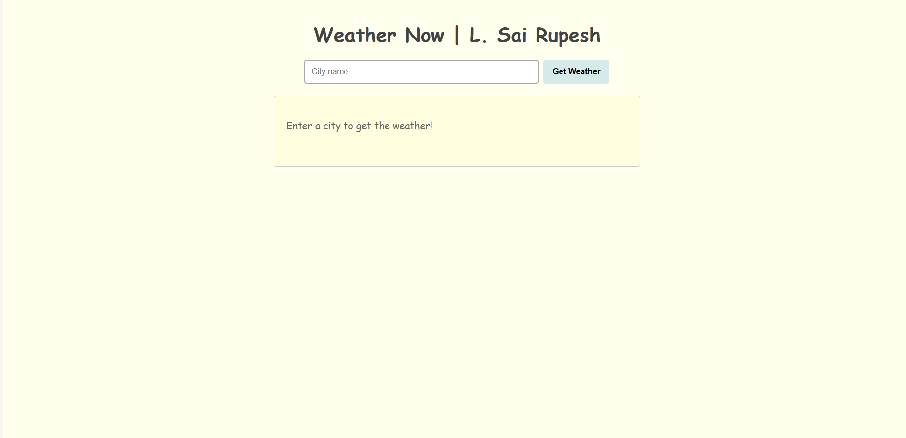
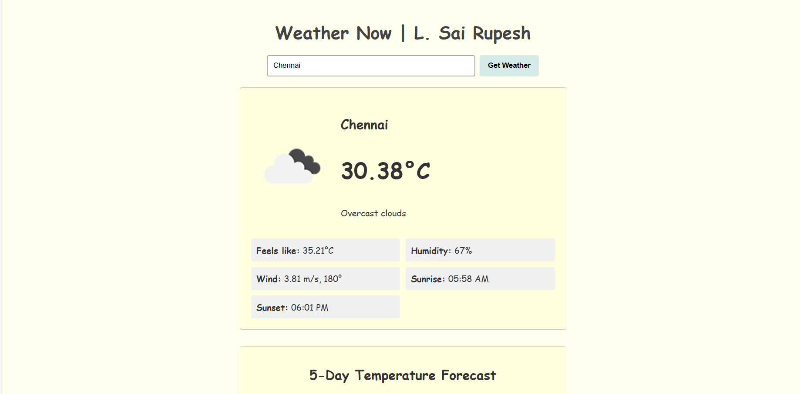
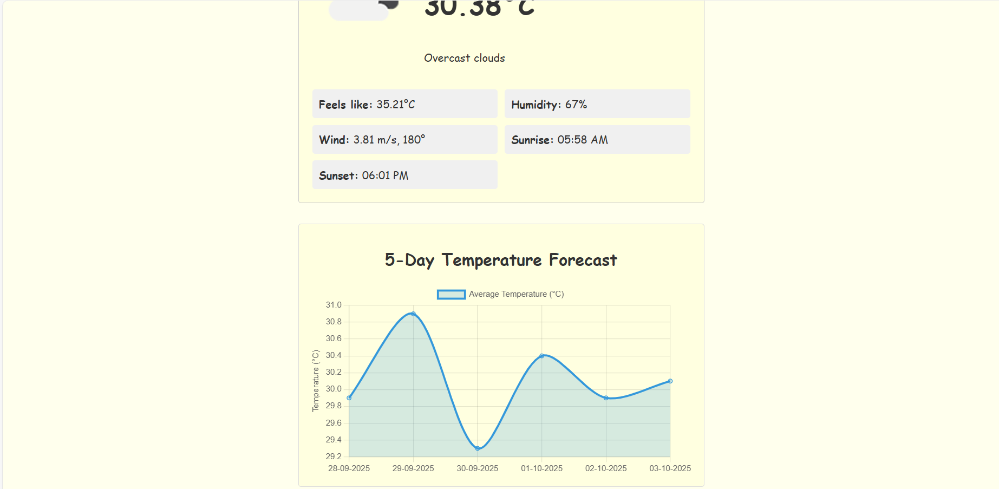

# 🌤️ Weather Now

**Live demo:** [https://weather-now-ayyq.onrender.com/](https://weather-now-ayyq.onrender.com/)

A simple weather web app where you can enter any city and instantly see the current weather and a 5-day forecast.

---

## Features

-  Search for any city worldwide
-  5-day temperature forecast
-  Real-time weather info: temperature, description, etc.
-  Graceful error handling for invalid cities

---

## 🛠️ Tech Stack

- **Frontend:** HTML, CSS, JavaScript
- **Backend:** Node.js, Express.js, dotenv
- **API:** OpenWeatherMap
- **Deployment:** Hosted on [Render](https://render.com)

---

## 🖼️ Screenshots





---

## 📦 Installation

Clone the repo and run locally:

<pre>```bash
git clone https://github.com/sairupeshl/weather-now.git
cd weather-now
npm install
npm start```</pre>


## 🔌 API Usage

### Current Weather Endpoint

`GET /current/current_weather?city=CityName`

---

**Description**

Fetches the current weather data for the specified city.

---

### Forecast Endpoint

`GET /current/forecast?city=CityName`

---

**Description**

Fetches the weather forecast for five days for the specified city.

---
